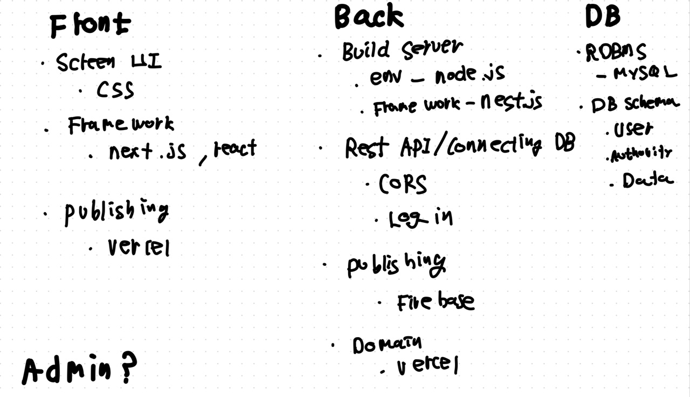

# Project_A_improving_communication
Starting project to improve the commuication between instructor, students and parents
### 20230811_Day_1
#### What did I do?
1. Think about the problem, which means why I have to start this project
   - I have felt for a long time since 2015 inconvenience about the communication between instructor, students and parents
   - In the process of letting students know the assignments, notifying again and sending a report of the class done at the day
   - I don't have any plan to make this service public yet.
   - **Just to improve the communication between us**
2. Ask developers what I have to do for building the service
   - Umm, lots of things which mostly I don't understand.
     - But I think "We don't lack resource, but intention and action"
     - I'll organize the things I've thougth and heard tomorrow
3. Ask myself
   - You know, this is not commercial thing, which means this will not be profitable
   - Do you wanna really do this?
     - I have had strong desire to improve my life buiding and creating somethinig
     - Why Not?
***
### 20230812_Day_2
#### The process establishment of solving the problem throughout the project
1. What's the problem, dude?
2. How do you want to solve?
3. What will you do to solve it in this way?
	
#### Organize the thoughts in my head using the problem recognizing process
1. What's the problem, dude?
	1) Infinite repetition of asking and answering 
    	- Even though I sent their parents the report containing the range of assignments, the students have been asking me of it again and again even when taking a shower.
	2) Not being able to check if they did their assignments or not
		- It's natural to do their assignments, but they don't sometimes
		- This leads to a huge serial problem of how much I have to prepare for the class
  	3) 'Write down Today's Report and Send it to parents procedure' is quite repetitive 
    	- Write down for each student' parent, copy and paste in Kakaotalk; this procedure happens every day
    	- Class report contains messages about how many class had been done and left, which is related to sending tutoring fee
  	4) Parents can't check the whole reports at one sight
		- Every reports are separatedly sent between other messages about the notice and sudden cancellation of class
2. How do you want to solve?
	1) Make a assignment bulletin board which both side(istructor and student) commnunicates
		- Each students could see only their assignments.
    	- They are connected with the assignment bulleting board link on the notice part of kakaotalk chat room
  	2) Next to the assignment, there is a check box which student can press
    	- Before one day of class, send a message about their assignment check
	3) Write -> Choose person -> Press button -> Send message through kakaotalk
		- I don't know whether this would work. But I'll try
	4) Each parents could see only their students' reports on the list form
		- Q. Should Parents and Students share some key to make a pair? Is it necessary? Is it possible? 
    	- A. One side of parents don't need to see other sides' report lise. So yes it is necessary. But I don't know how to make it available. Find it
3. What will you do to solve it in this way?
   	1) Technical thing(actually asked other developers "I'm strongly wanting to make something. But I don't know how. So let me know.)
   	   	- This is the answer they gave me(I just organize it with shit hand writing; not good at it)
   	   	   
